# Watson Assistant Lab - Part 1: Building a bot from scratch

Sign up for an [IBM Cloud account](https://console.cloud.ibm.com). If you already have an account, sign into your account.  

## Step 1: Designing Your Bot

Building a chatbot with Watson Assistant is so easy, some developers choose to dive right into the tooling. However, with a well-thought out, well-planned chatbot, the interaction with the user can lead to a much better experience that can handle edge cases. In this section, we will design the interaction between a user, Dave, and a chatbot named PlanBot.

A good question to ask yourself is, "Who is my user and what problem do they have?" Expand on the user's profile by determining what the user needs from this chatbot. Does the user have a need to book a reservation at a restaurant? Or an answer to a common question like "Where's the bathroom?" at a conference. Maybe a chatbot that handles tasks like turning on lights or other equipment. It might help to think of the chatbot as an automated version of an existing agent, such as a customer service agent. Look at existing processes that include repeated manual processes, which can sometimes be augmented with chatbots.

Training a chatbot is like training a human agent. You will train the chatbot with the knowledge of certain tasks (intents) and things that these tasks interact with (entities). These components are then combined to create a dialog tree that can take one or more paths to respond to the user's request.

In the following steps, we have provided an insurance chatbot that handles simple questions around plans and claims.

1.  Envision the user that interacts with the bot.  

    | Examples                                         |  
    | ----------------------------------------------- |  
    | A user needs to get information about available plans  |  

1.  Now, let's describe the overall function of the chatbot.  

    | Example                                                   |  
    | --------------------------------------------------------- |  
    | The chatbot, helps users with basic plan and claim inquiries. |  

1.  Let's start with the action the user wants to do, which is referred to as an intent. Frist we write a human-friendly description of the action the user is wanting to perform. Then we list a couple of ways the user might phrase this request. Lastly, add a label, like a variable name in code (alpha-numeric, underscores, etc.), that can be used later as a reference.  

    | Intent  | Examples  | Label |  
    | ------- | ------- | ------- |  
    | General plan information  | Tell me about HSA , What plans do you offer ?, What is HIA ?  | #General_Plan_Info |  
    | Contribution information  | Whats the max contribution, How is HSA funded ?  | #Plan_Funding_Contributions  |  
    | Initiate a payment | Pay my premium. |  #Payment  |  

    If you find that you don't have many variations, invite a colleague, a friend (or a real user!) to suggest how they would ask request the these actions. In the real world, you would use real world customer interactions as a basis for training.  

1.  Another component to training a chatbot is recognizing objects, which are referred to as entities. This example plan bot can differentiate different types of plans.  

    | Entity  | Values  | Label |  
    | ------- |  ------- | ------- |  
    | Plan Type  | HSA, HIA | Label: @plan |  

    We could add time, number and currency entities, however, there are some built-in system entities provided by IBM, that the bot will use.

In the Dialog editor of Watson Assistant, we can now setup logic to step the user through the conversation. In the next section, we will use this design to train the Watson Assistant service.

## Step 2: Train Watson Assistant Service

Now that we have designed the first dialogue between the chatbot and the user, we can train the Watson Assistant service.  

1.  **Click on the Catalog*** link in the top-left corner of the IBM Cloud dashboard.

1.  **Select the AI category** on the left, under 'All Categories'.

1.  **Select the Watson Assistant** service tile.  
    

1.  Click **Create** (*Leave default options for Lite plan and service name*)

1.  Click on the  **Launch tool** button to launch into the Watson Assistant tooling.  
    

1.  This is the Watson Assistant tooling where you can create workspaces and setup different chatbots dialogues and applications. There is an example Customer Service sample workspace where you can see a more evolved training. However, we'll create a new workspace for our bot to use. Click on **Workspaces** and then on  **Create**   in the box labeled **Create a new workspace**.  
    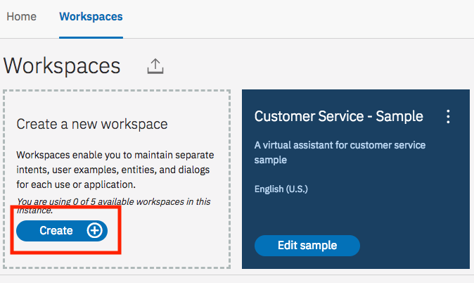

1. Enter a name for the chatbot and optionally a description, then click **Create**  
    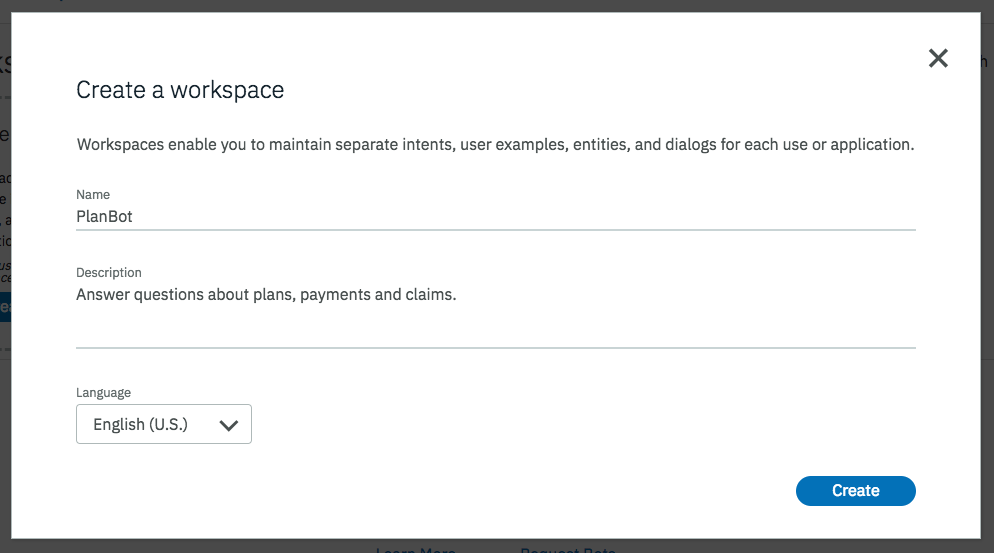

1.  You will be redirected into a page with four tabs, Intents, Entities, Dialog, and Content Catalog. Before we create our custom intents. Lets make use of some of the content provided by the Watson Assistant Service. Click on the **Content Catalog**

1.  The Content Catalog provides some pre-trained intents that you can use in your chatbot. Take a look at the various categories of intents. Click on the **General** category.

1.  There are several common interactions the chatbot can take advantage of from this category. Click on the **Add to workspace** link on the top right corner of the page. You will receive a message that the intent was added to your workspace. Click on the **Arrow** next to the category name 'General'.  
    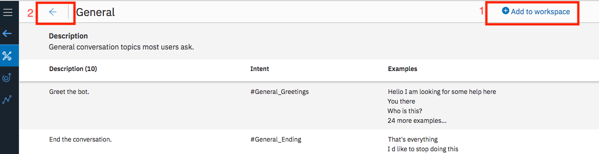

1.  Click the **Intents** tab, click on **Add intent** to create the first custom intent.

1.  Name the intent *plan_general_information* and click **Create intent**  
    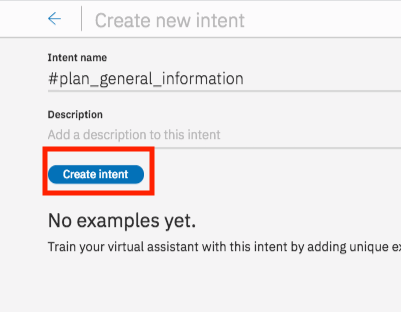

1.  Add the example utterances shown in the screenshot below, clicking on **Add example** after entering each one.  
    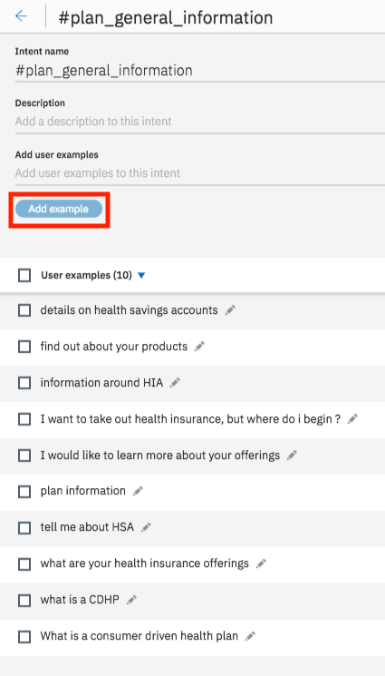

1.  Click on the return icon to go back to the main menu screen  
    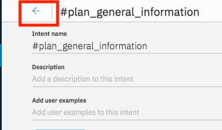

1.  Repeat Steps 10 - 13, to create two additional intents as shown below.  
    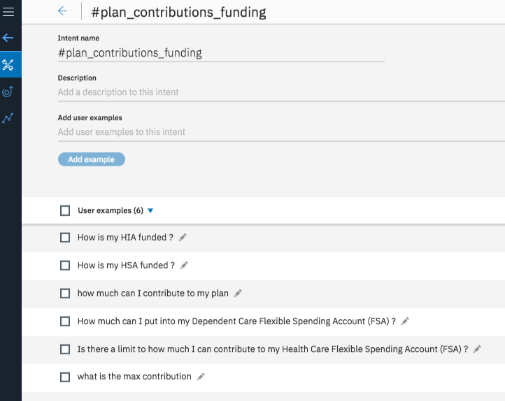  
    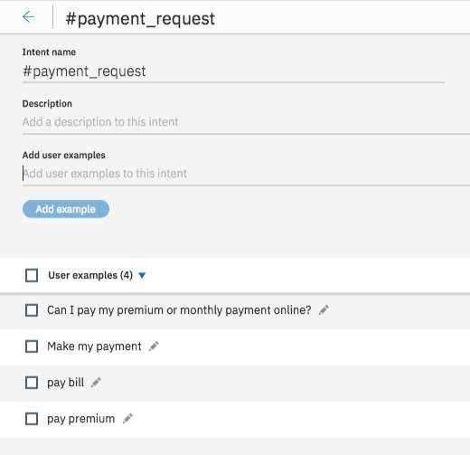

1.  Go ahead and test the chatbot as it is (You will be testing the intent classification). Click on the **Try it** button on the top right of the page. *If there is a purple banner on the Try It Out panel, you will have to wait until training is completed*.  Enter some text in the panel to have Watson Assistant identify the intent.  
    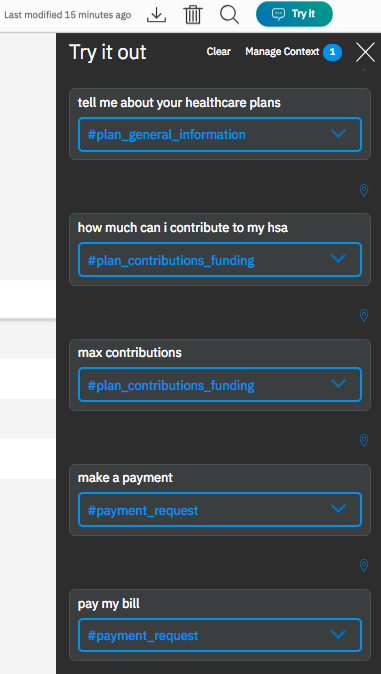

1.  Close the 'Try it out' panel by clicking the X on the top right corner. Then Click on the **Entities** tab in the top menu bar. This is where you can add the "objects" that will be extracted from the user input. Click **Add entity**

1.  Name the entity *Plan_Type* and add the following values clicking **Add value** after entering each one  
    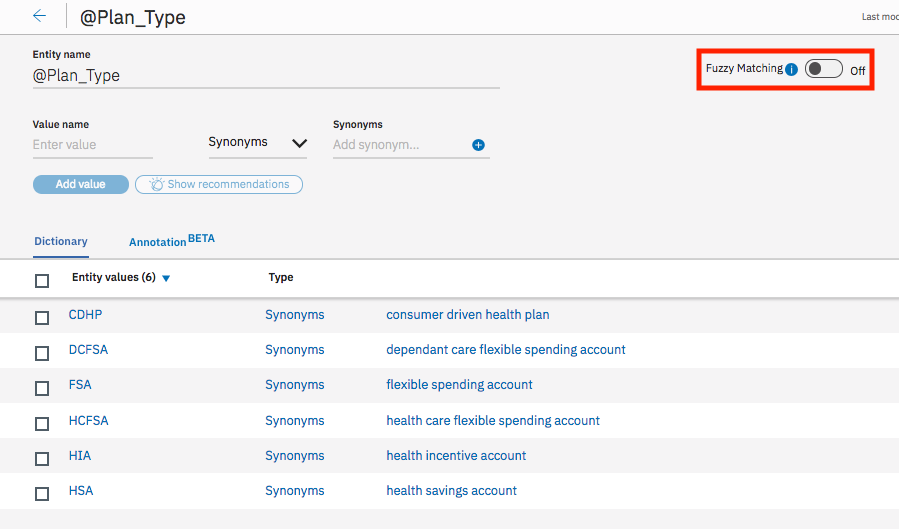

1.  Click in the return icon to go back to the main menu screen

1.  The Watson Assistant has a handful of common entities created by IBM that can be used across any use case. These entities include: date, time, currency, percentage, and numbers. Click on **System entities** and enable @sys-currency, @sys-date, @sys-number and @sys_person  
    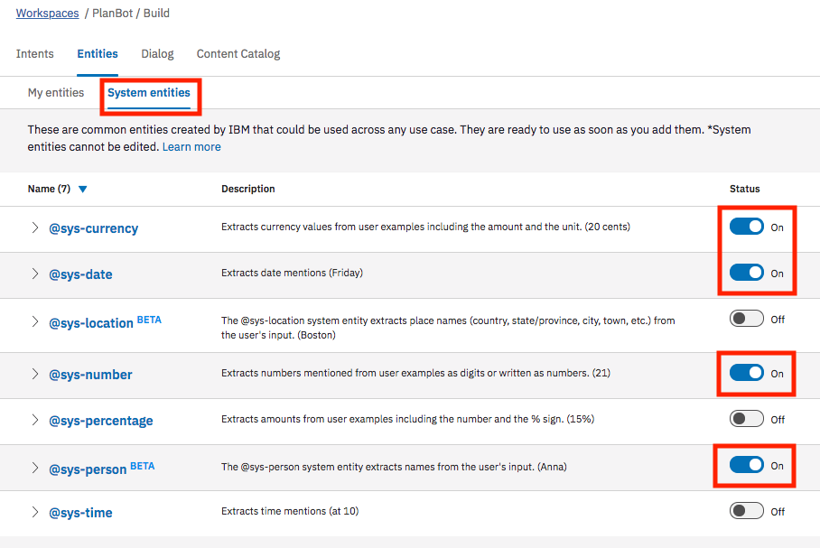

1.  ***[Optional]*** Feel free to test out the entity extraction using the 'Try it out' panel, as you did in step 16.

1.  Click on the Dialog tab in the top menu bar. Click **Create**. There are two nodes added by default. The welcome condition is triggered when the chatbot is initially started. This is a good place to introduce the bot and suggest actions the user can ask of this chatbot. Select the Welcome node and change the response as shown below:  
    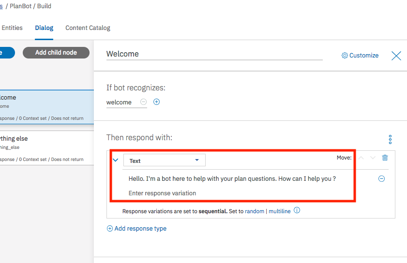

1.  The second node checks for the condition anything_else. In the event the user enters something that wasn't expected, the service will return this response. Ideally, it should convey a way for the user to recover, such as example phrases.  
    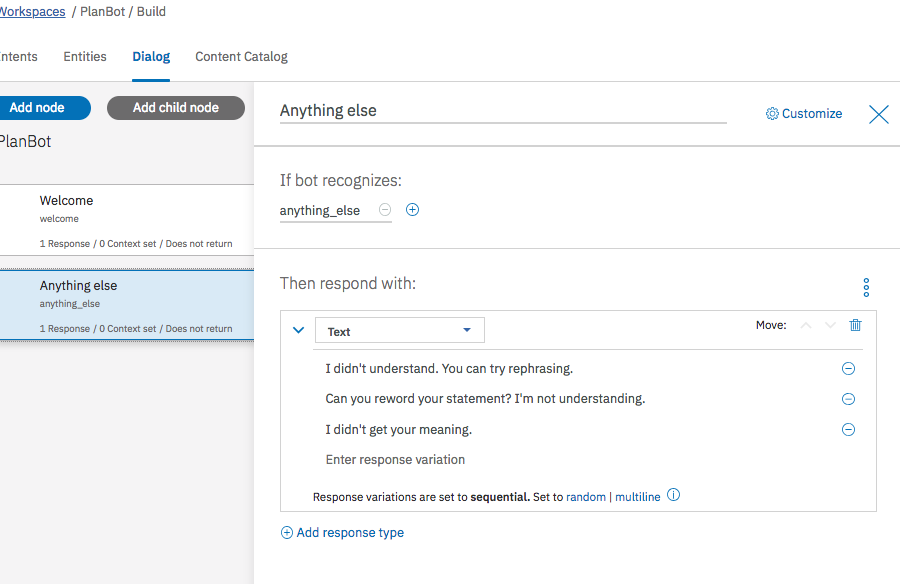

1.  Lets add a dialog node to handle some of our pre-built intents. Select the Welcome node again and click **Add node**. In the dialog node editor, enter a node name. For the input triggers, have it set to when the intents **#General_Agent_Capabilities** or **#General_Greetings** are identified (ensure the trigger is an OR of the two conditions). In the response, add a text response as shown below.  
    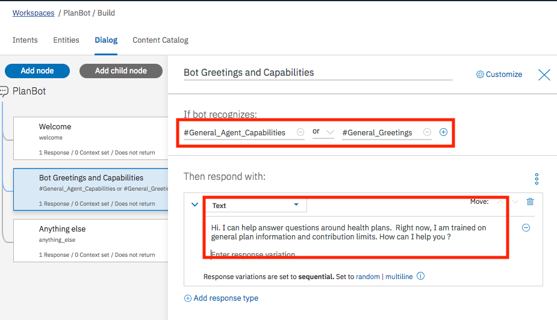

1.  To handle the general plan information queries, we will add a couple of nodes to the dialog tree. Select the node created above and click **Add node** to create a new node. In the dialog node editor, enter a node name (i.e. 'Plan Information'). For the input triggers, have it set to the intent **#plan_general_information** . There is no need to add any response text.  
    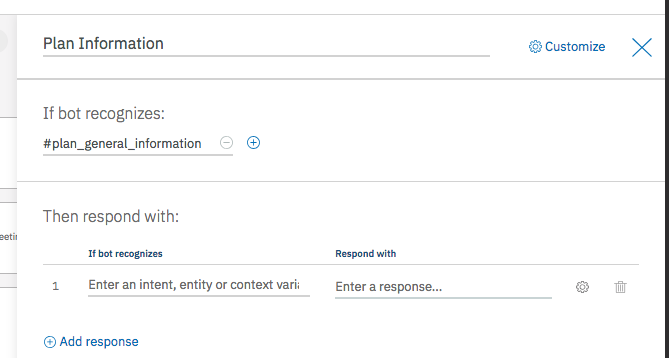

1.  Select the newly created 'Plan Information' node, then click the **Add child node** button.  In the dialog node editor, enter a node name (i.e. 'Current Plan Responses'). For the input triggers, have it set to the entity type **@Plan_Type** . Then click the **Customize** link next to the name and enable Multipe responses for the node and click the **Apply** button. Complete this node by adding three responses for the three different plans ()  
    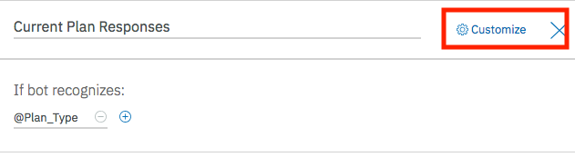  
    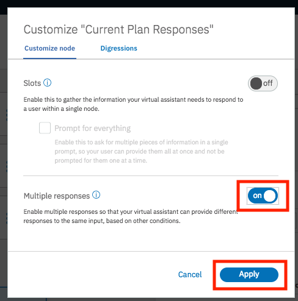  
    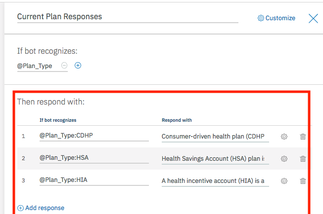

    Here are some sample responses you can use in your nodes for each of the plans:

    | Plan Type  | Response |  
    | ------- | ------- |  
    | CDHP | Consumer-driven health plan (CDHP) is a high-deductible plan that also includes a tax-free health savings account (HSA), health incentive account (HIA) or health reimbursement account (HRA). You may put tax-free money into your account, or your employer might put money in - sometimes as a reward for steps you’ve taken for better health, depending on your plan. Then you use that money for your share of care costs, like your deductible or coinsurance. |  
    | HSA | Health Savings Account (HSA) plan is a high-dedutible plan that also includes a tax-free HSA. You can put tax-free money into it. Then use that money for your share of care costs, like your deductible or coinsurance. You can see all of the types of costs you can cover with money in your HSA. But remember that only cost your plan covers will go toward paying down your deductible.  |  
    | HIA|  A health incentive account (HIA) is a health account set up by your employer health plan. You earn dollars in your account when you take certain steps to improve your health. You use that money to pay for your share of care costs, like your deductible or coinsurance. If you don’t use all the money, it stays in there next year as long as you’re still at the same job. |  

1.  Select the 'Plan Information' node, then click the **Add child node** button.  In the dialog node editor, enter a node name (i.e. 'Prompt for Plan'). For the input triggers, set it to **true** . Add the responses as shown in the screen shot and in the 'And finally' section, set the action to **Jump to**, selecting the 'Current Plan Response' node and the 'Wait for user input' option  
    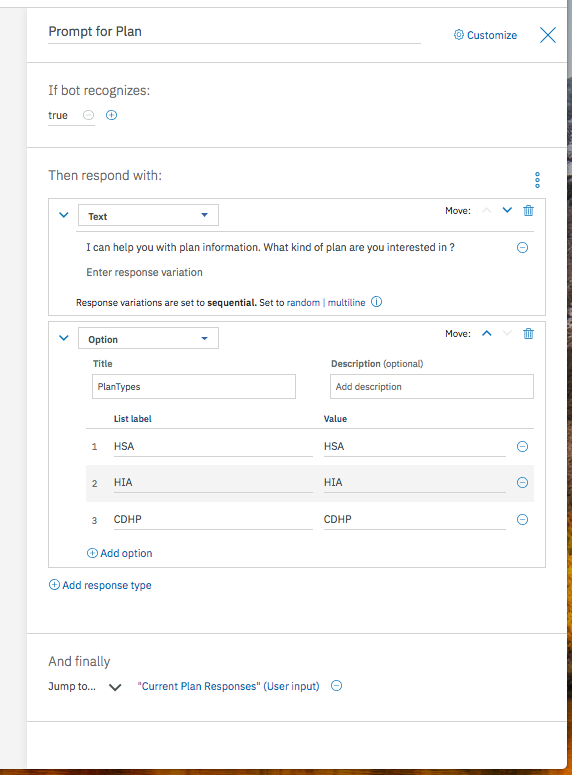

1.  Select the 'Plan Information' node. In the 'And finally' section of the node editor, set the action to **Jump to**, selecting the 'Current Plan Response' node and the 'If bot recognizes (condition)' option  
    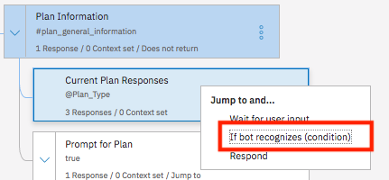

1.  Your dialog tree should now look as shown below. ***[Optional]*** Feel free to test out the dialog using the 'Try it out' panel,  
    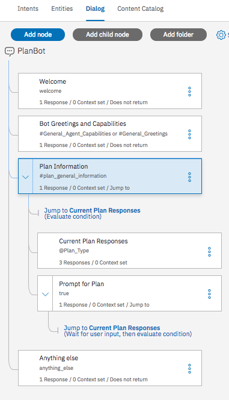

1.  ***[Optional]*** Following a similar process as steps 25 - 29, add dialog nodes to address the plan contribution intent.  
    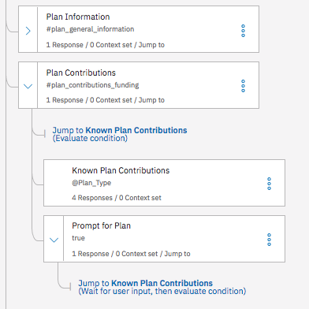

1.  We will now add another dialog node to handle payments. We will use the slots feature of Watson Assistant, which will simplify the process of gathering the information necessary for a payment. In the dialog tree, add a node at the root / top level. Name the node *Payment* and select the #payment_request intent as the trigger where it says **If bot recognizes**. Then click on **Customize** in the top right corner and enable Slots. Click **Apply**  
    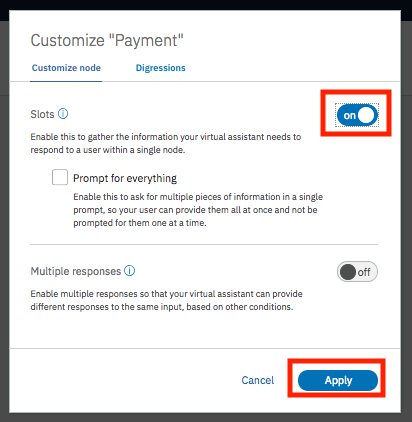

1.  Add three slots as follows (clicking **Add slot** to add each slot section)  

    | Check for  | Save it as  | If not present, ask |  
    | ------- | ------- | ------- |  
    | @sys-date  | $payment_date  | What is the payment date ? |  
    | @sys-currency | $payment_amount  | How much would you like to pay ?  |  
    | @sys-person | $policy_holder_name |  What is the policy holders name ? |  

    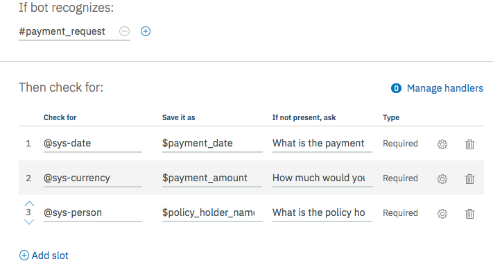

1.  Have the bot respond with the details of the payment. The syntax uses the values stored in the context and injects the values into the response. The full text should read: `I'll schedule a payment of <? $payment_amount ?> on <? $payment_date ?> for policy holder <? $policy_holder_name ?>`  
    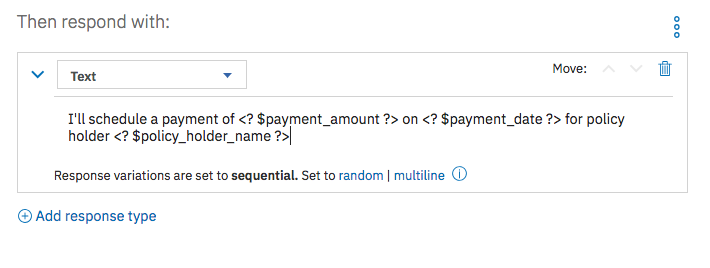

1.  Use the 'Try it out' panel to test your Watson Assistant chat bot. Click on the **Try it** icon in the top-right corner of the tooling.  
    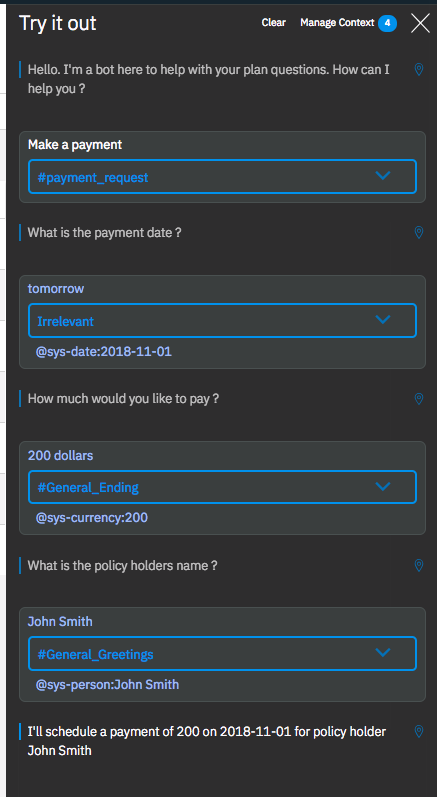
