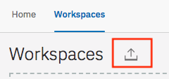
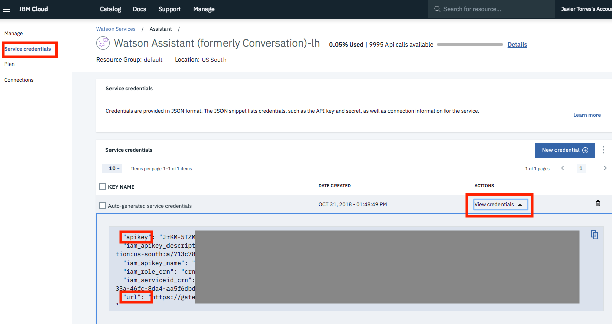
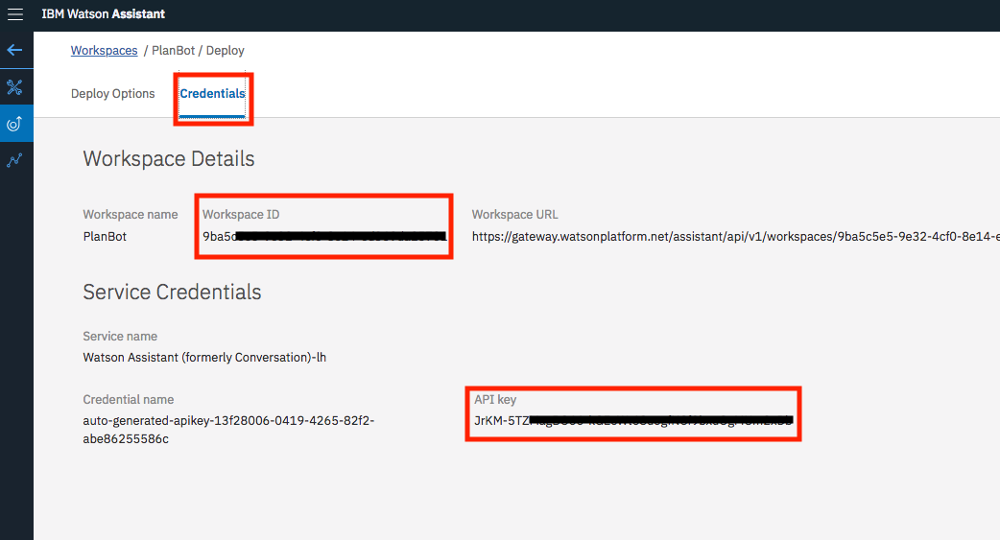

# Introduction to Watson Assistant

## Overview

Watson Assistant service combines machine learning, natural language understanding, and integrated dialog tools to create conversation flows between your apps and your users. In this lab, you will create a workspace and understand the terminology of creating a chatbot.

This application is based on the code pattern published here - [Slot Code Pattern](https://developer.ibm.com/patterns/assemble-a-pizza-ordering-chatbot-dialog/) and the [Watson Assistant Simple application](https://github.com/watson-developer-cloud/assistant-simple)

### Flow

1. User sends messages to the application (running locally or on IBM Cloud).
2. The application sends the user message to IBM Watson Assistant service, and displays the ongoing chat in a web page.

   

### Featured Technologies

* [IBM Watson Assistant](https://www.ibm.com/watson/developercloud/conversation.html): Build, test and deploy a bot or virtual agent across mobile devices, messaging platforms, or even on a physical robot.
* [Node.js](https://nodejs.org/): An asynchronous event driven JavaScript runtime, designed to build scalable applications.

### Prerequisites

*  Create a directory, open a terminal (bash on Mac, Linux, PowerShell on Windows) and change into this directory.

*  Clone the project to this directory

   `docker run -ti --rm -v "$(pwd):/git" alpine/git clone https://github.com/jrtorres/watson-assistant-lab.git`

## Building the bot

### Part 1: Create the basic structure

* Complete the steps in [Build the bot from scratch](PART1_BUILDBOT.md) to build the basic chatbot.
* Once you're done, go ahead and test the chatbot using the [simple client application](#run-the-application).

### Part 2: Extend the bot

* Complete the steps in [Extend the bot](PART2_EXTENDBOT.md) to extend your chatbots capabilities.
* Once you're done, go ahead and test the chatbot using the [simple client application](#run-the-application).

## Run the Application

### Run locally

Complete the steps outlined [above](#building-the-bot) to build the chatbot from scratch. Alternatively, you can Launch the **Watson Assistant** tool and use the `import` icon button on the right to import the completed chat bot workspace.



Find the desired local version of the workspace JSON file [Part 1 Workspace](training/plan-bot-part1.json) or [Part 2 Workspace](training/plan-bot-part1.json) and select `Import` (make sure you import everything).

#### Add IBM Cloud service credentials and Workspace ID to .env file

1.  As you create the IBM Cloud services, you'll need to use the service credentials to interact with these services. You might get either IAM or username/password based credentials based on the region. To find these credentials, from the IBM cloud console, click on the Watson Assistant service instance you created and click on **Service credentials**

   

2.  Using a text editor open the *.env.example* file from the source code folder.

3.  Add the service credentials that you obtained for the service. The Watson SDK automatically locates the correct environment variables for either `username`, `password`, and `url` or the `apikey` and `url` credentials.

   * If your service instance uses `username` and `password` credentials, add the `ASSISTANT_USERNAME` and `ASSISTANT_PASSWORD` variables.

    ```
    ASSISTANT_USERNAME=XXXXXXXXXXXXXXXX
    ASSISTANT_PASSWORD=XXXXXXXXXXXXXXXX
    ASSISTANT_URL=https://gateway.watsonplatform.net/assistant/api
    ```

   * If your service instance uses an IAM API key, copy the `apikey` and `url` to the relevant fields.

    ```
    ASSISTANT_IAM_APIKEY=caXXXXXXXXXXXXXXXXX
    ASSISTANT_URL=https://gateway.watsonplatform.net/assistant/api
    ```

    Once updated, save the changes to a file named `.env`

4.  To interact with the chatbot, you will need the unique identifier for your workspace.  You can find this workspace ID in the deploy tab of the Watson Assistant tooling.

      

    Add this id to the `WORKSPACE_ID` property in the .env file:

    ```
    WORKSPACE_ID=522XXXXXXXXXXXXXXXXXX
    ```

#### Start the application

1.  From a terminal in the `watson-assistant-lab` directory, start a developer container with the bash prompt and then change the directory in the container into the repository.

    ```bash
    docker run -it --rm -v "$(pwd):/repo" -p 3000:3000 timrodocker/mydev bash
    cd repo
    ```

1.  Install the dependencies

    ```
    npm install
    ```

2.  Run the application

    ```
    npm start
    ```

3.  View the application in a browser at `localhost:3000`

### Running on IBM Cloud
You could also deploy the application to to IBM Cloud as a Cloud Foundry Application

1.  Using a text editor update the *manifest.yml* file. Change the **name** field to something unique. For example, `- name: my-app-name`.

2.  Start the developer container and change into the respository folder:

    ```bash
    docker run -it --rm -v "$(pwd):/repo" -p 5000:5000 timrodocker/mydev bash
    cd repo
    ```
3.  Login to IBM Cloud with the [IBM Cloud CLI](https://console.bluemix.net/docs/cli/index.html#overview): `ibmcloud login`
4.  Target a Cloud Foundry organization and space: `ibmcloud target --cf`
5.  Deploy the application using `ibmcloud app push`
6.  View the application online at the app URL (found on your IBM Cloud console).

If the deployment fails, due to a service name not found issue, you could
* Change the names of your IBM Cloud services to match the names in the manifest.
* Change the names in the manifest to match the names of your IBM Cloud services.

# License

This sample code is licensed under Apache 2.0.  
Full license text is available in [LICENSE](LICENSE).

# Links

* [IBM Watson Assistant Docs](https://console.bluemix.net/docs/services/conversation/dialog-build.html#dialog-build)
* [Blog for IBM Watson Assistant Slots Code Pattern](https://developer.ibm.com/code/2017/09/19/managing-resources-efficiently-watson-conversation-slots/)
* [Tutorial - Deploy a chatbot on IBM Cloud Kubernetes](https://developer.ibm.com/tutorials/set-up-your-own-instance-of-a-chatbot-and-deploy-it-to-the-kubernetes-environment-on-ibm-cloud/?social_post=1872588192&fst=Learn)

# Learn more

* **Artificial Intelligence Code Patterns**: Enjoyed this Code Pattern? Check out our other [AI Code Patterns](https://developer.ibm.com/code/technologies/artificial-intelligence/).
* **AI and Data Code Pattern Playlist**: Bookmark our [playlist](https://www.youtube.com/playlist?list=PLzUbsvIyrNfknNewObx5N7uGZ5FKH0Fde) with all of our Code Pattern videos
* **With Watson**: Want to take your Watson app to the next level? Looking to utilize Watson Brand assets? [Join the With Watson program](https://www.ibm.com/watson/with-watson/) to leverage exclusive brand, marketing, and tech resources to amplify and accelerate your Watson embedded commercial solution.
* **Kubernetes on IBM Cloud**: Deliver your apps with the combined the power of [Kubernetes and Docker on IBM Cloud](https://www.ibm.com/cloud-computing/bluemix/containers)
